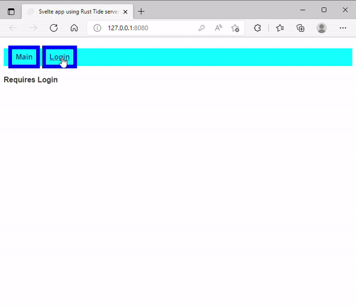

# Svelte-Tide-Project

Starter template for [Svelte](https://svelte.dev) frontend apps with Rust [Tide](https://docs.rs/tide/latest/tide/) backend server.  Contains an example of using sessions to store user login and access secure area.

Ideas taken from https://github.com/sachinbhutani/svelte-on-rust which combined rocket.rs and svelte.



## Requirements

NodeJs - [Install](https://nodejs.org/en/download/)

Rust  - [Install](https://www.rust-lang.org/tools/install) 


## Get started
Create a new project based on this template using [degit](https://github.com/Rich-Harris/degit) and 
install the dependencies...

```bash
npx degit jbertovic/svelte-tide-project svelte-tide-project
cd svelte-tide-project
npm install
```

...then start Tide server and [Rollup](https://rollupjs.org) in two different terminals 

Terminal 1: (To run the rust server)
```bash
cargo run  
```
Terminal 2: (To build and hot reload svelte components)
```bash
npm run dev  
```

Navigate to [localhost:8080](http://localhost:8080). You should see your app running. 
All svelte front end code lives in `src_front` directory. Save any changes live-reloading.
All tide server back end code lives in `src` directory. To rebuild Rust code use cargo run after saving your changes. 
All static files are served from `public` directory. Including the JS code compiled by Svelte Compiler.


## Building and running in production mode

Currently the store for the sessions in `Tide` is accomplished using a simple `MemoryStore` which isn't meant for production.

To create an optimised version of the app:

```bash
npm run build
cargo build
```
